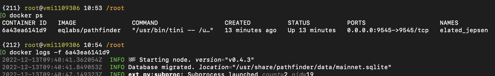

# Starknet-Node
Starknet Full Node


# 1) Before installing node, get your endpoint from Alchemy.

read [alchemy](./alchemy.md)

# 2) Install the node.

## 2a) Scripted installation

```sh
wget -O starknet.sh https://raw.githubusercontent.com/bxdoan/Starknet-Node/main/starknet.sh && chmod +x starknet.sh && screen -S starknet -d -m bash -c "cd $SH/$DIRECTORY && ./starknet.sh"
```

## 2b) Manual installation

You can also install the node [manually](https://github.com/bxdoan/Starknet-Node/blob/main/Starknet_manual.md) to improve your Node knowledge.

## Continue.

### Open a screen.

```
screen -S starknet
```

### Start your node.

```
mkdir -p $HOME/pathfinder
docker run \
  --rm \
  -p 9545:9545 \
  --user "$(id -u):$(id -g)" \
  -e RUST_LOG=info \
  -e PATHFINDER_ETHEREUM_API_URL="<HTTPS URL FROM ALCHEMY>" \
  -v $HOME/pathfinder:/usr/share/pathfinder/data \
  eqlabs/pathfinder
```

Here is a sample command.

```
mkdir -p $HOME/pathfinder
docker run \
  --rm \
  -p 9545:9545 \
  --user "$(id -u):$(id -g)" \
  -e RUST_LOG=info \
  -e PATHFINDER_ETHEREUM_API_URL="https://eth-mainnet.g.alchemy.com/v2/COsy1IzxkLxxxkRyxxxIpxwJxxxx" \
  -v $HOME/pathfinder:/usr/share/pathfinder/data \
  eqlabs/pathfinder
```

## 3) Check your logs.

Learn Docker Container ID with following command.

```sh
docker ps
```


After that, check your node logs. Change `<ID>` part with the Container ID that you obtained from the command above.

```sh
docker logs -f <container id>`
```



# Your node is syncing


## Contact
If you have any questions, please contact me at [Telegram](https://t.me/bxdoan)

## Thanks for use
[](https://paypal.me/bxdoan)
